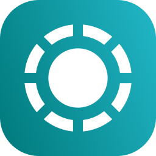
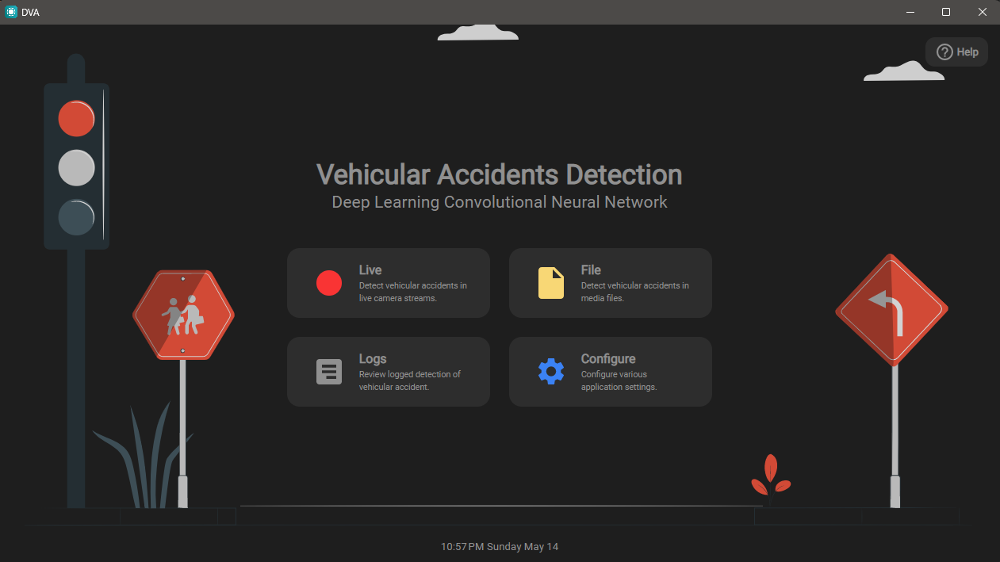

  
  
<h1 align="center"> <strong> DVA </strong> </h1>
<h3 align="center"> Vehicular Accident Detection using AI

<a href="https://github.com/m-visaya/DVA/releases"><strong> Download Latest </strong></a>

 
 
  

 DVA (Detection of Vehicular Accidents) is an offline desktop application that integrates a deep learning binary classifier. The classifier is capable of detecting vehicular accidents from CCTV streams or video files. Detected accidents are logged using SQLite and the captured accident frames are saved in the user's  <code>Documents</code> folder. 

 

  

 
 
 

<h2 align="left">Development Tools</h2>

  
  
  
  
  

 
 

   <h2>Requirements</h2>

- Node <code> v16.15.1 </code>
- WiX Toolset <code> v3.11 </code> (for building the app locally)

 
 

   <h2>Local Development</h2>

   <h3>Clone the repository</h3>

    git clone https://github.com/m-visaya/DVA.git

   <h3>Install dependencies</h3>
  
    cd DVA
    npm install --legacy-peer-deps
    
    cd src/render
    npm install --legacy-peer-deps

 

   <h3>Run the Vite server</h3>
   On the <code>DVA/src/render</code>  directory run:
    
  
    npm run dev
 

   <h3>Run the Electron App</h3>
   On the root folder <code>DVA</code>:
    

    npm run start

 

   <h2>Build the Application</h2>

On the <code>DVA/src/render</code> directory run:
 

    npm run build

On the root folder <code>DVA</code>:
 

    npm run make

 
 

    <h2>Developers</h2>

- <a href="https://github.com/rcbern">@rcbern</a>
- <a href="https://github.com/BKManabat">@BKManabat</a>
- <a href="https://github.com/m-visaya">@m-visaya</a>

 

#

<a href="https://github.com/m-visaya/DVA/issues/new">Report Bug</a>
●
<a href="https://github.com/m-visaya/DVA/issues/new">Request a Feature</a>
